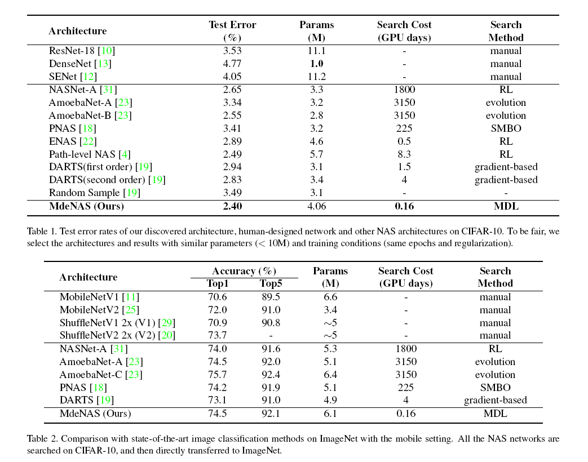
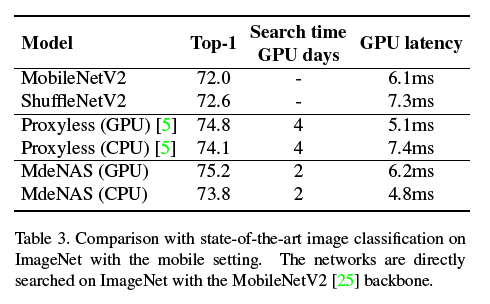

# Multinomial Distribution Learning for Effective Neural Architecture Search

Here we propose a method to extremely accelerate NAS, **without reinforcement learning or gradient**, just by sampling architectures from a distribution and comparing these architectures, Iteratively updating parameters of distribution while training


Here we provide our test codes and pretrained model, our code is based on [DARTS](<https://github.com/khanrc/pt.darts>) and [ProxylessNAS](<https://github.com/mit-han-lab/ProxylessNAS>), pretrained models can be downloaded [here](https://drive.google.com/open?id=1W0UqwAnm37uibTuPDrH5Mt8PKNvFdD3v)

## Requirements

- PyTorch 1.0
- DALI

## Evaluate

You need to modified your path to dataset in ``` data_providers/cifar10.py``` and ```data_providers/imagenet.py```

To evaluate the model in **DARTS setting**, just run

for ```cifar10``` :

```bash
chmod +x run_darts_cifar.sh
./run_darts_cifar.sh
```

for ```imagenet``` :

```bash
chmod +x run_darts_imagenet.sh
./run_darts_imagenet.sh
```

To evaluate the model in **Mobile setting**, just run

for ```gpu``` :

```bash
chmod +x run_gpu_imagenet.sh
./run_gpu_imagenet.sh
```

for ```cpu``` :

```bash
chmod +x run_cpu_imagenet.sh
./run_cpu_imagenet.sh
```

# Performance



